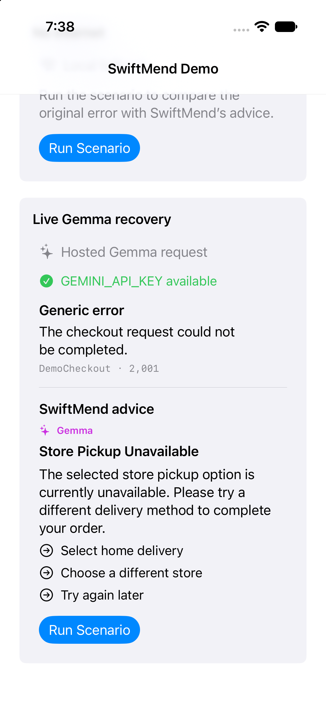
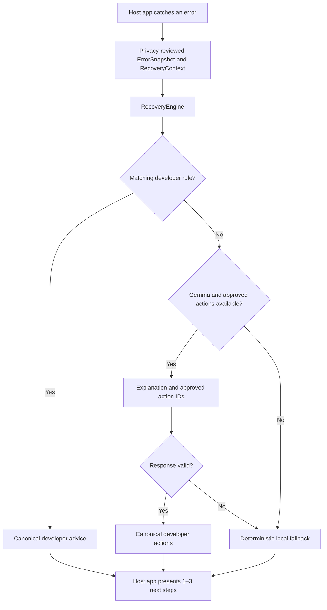

# SwiftMend

> Safer recovery guidance for Swift app errors, powered by constrained Gemma.

[Watch the 2:52 demo](https://www.youtube.com/watch?v=m3QOL5QlNrk) ·
[View the Devpost project](https://devpost.com/software/swiftmend) ·
[Jump to installation](#install)

SwiftMend is a UI-independent recovery SDK that helps Swift developers turn
caught errors into clear, safe next steps for app users. The host app supplies
a privacy-reviewed diagnostic and developer-approved policy; SwiftMend chooses
the safest available recovery path without claiming to catch every failure or
automatically repair the app.

The recovery engine always prefers matching developer rules. If no rule
matches, it asks an optional model provider to explain the failure and select
one to three developer-approved action IDs. It falls back to local advice when
the provider, catalog, network, API, or response is unavailable or invalid.

<p align="center">
  
</p>

## Why SwiftMend

Generic error messages leave users stuck even when a safe recovery action is
available. Developers can write tailored guidance for every failure, but that
work is easy to postpone and difficult to keep consistent across authentication,
networking, checkout, uploads, and unexpected edge cases.

SwiftMend keeps developers in control while improving that experience. Exact
rules take priority, Gemma can explain the long tail of caught errors only by
selecting approved action IDs, and deterministic local advice remains available
when model guidance cannot be used.

## Architecture



## Install

Add SwiftMend as a Swift Package Manager dependency, then import it where an
error is caught:

```swift
import SwiftMend
```

## Integration

Capture an error through [Apple unified logging](https://developer.apple.com/documentation/os/logging),
then pass the same sanitized snapshot to the recovery engine:

```swift
let context = RecoveryContext(
    feature: "account creation",
    attributes: ["minimumPasswordLength": "12"]
)
let diagnostics = OSLogDiagnosticSource(
    subsystem: "com.example.MyApp",
    category: "authentication"
)
let snapshot = diagnostics.capture(
    error: error,
    safeMessage: "The password could not be accepted.",
    safeDebugDescription: "Password policy validation failed.",
    context: context
)

let approvedModelActions = [
    RecoveryAction(id: "edit-password", title: "Edit Password"),
    RecoveryAction(id: "try-again", title: "Try Again")
]
let engine = RecoveryEngine(
    rules: approvedRules,
    fallbackAdvice: localFallback,
    approvedModelActions: approvedModelActions,
    modelProvider: modelProvider
)
let resolution = await engine.resolve(snapshot, context: context)
```

Only pass strings that are safe to display in Console and share with the
configured model provider. Do not include passwords, tokens, account data, or
raw server responses.

## Recovery flow

Model providers receive one request containing the reviewed diagnostic,
developer context, and the complete approved-action catalog:

```swift
public struct RecoveryModelRequest {
    public let snapshot: ErrorSnapshot
    public let context: RecoveryContext
    public let approvedActions: [RecoveryAction]
}

public protocol RecoveryModelProviding: Sendable {
    func recoveryAdvice(for request: RecoveryModelRequest) async throws -> RecoveryAdvice
}
```

SwiftMend resolves each error in this order:

1. A matching developer rule.
2. A configured model provider, but only when the approved catalog is valid and nonempty.
3. Local fallback advice.

The model response contains `title`, `message`, and one to three case-sensitive
`actionIDs`. SwiftMend rejects empty, duplicate, unknown, or excessive IDs and
maps accepted IDs back to the canonical `RecoveryAction` values supplied by the
developer. A model cannot rename an action or introduce a new one. The engine
repeats this validation even for custom providers, then uses the safe local
fallback if validation fails.

## Demo

The included SwiftUI demo has four flows:

- Password rejected resolves through a developer-approved rule.
- No internet resolves through local fallback advice.
- Store pickup unavailable asks hosted Gemma to explain the error and select
  only approved delivery or store actions.
- Photo upload too large sends a reviewed `DemoUpload` error for an 18 MB photo
  against a 10 MB limit and selects only approved photo recovery actions.

The complete walkthrough is available in the
[SwiftMend demo video](https://www.youtube.com/watch?v=m3QOL5QlNrk).

For the hosted scenarios, export the key and launch the demo from the same terminal:

```shell
export GEMINI_API_KEY="your-key"
swift run SwiftMendDemo
```

Select **Run Scenario** to compare the original generic error with the recovery
guidance. Each run also writes its reviewed diagnostic to Apple unified logging
under subsystem `com.lolkthxbai.SwiftMendDemo` and category `recovery`.

The UI reports whether `GEMINI_API_KEY` is available without displaying or
logging its value. It also labels every result as a developer rule, Gemma, or
local fallback. The first two scenarios never call the model.

The hosted scenarios send only reviewed sample diagnostics and their action
catalogs to Google. They are labeled **Hosted Gemma · approved actions only**.
The store-pickup diagnostic uses:

- Domain and code: `DemoCheckout`, `2001`
- Message: `The checkout request could not be completed.`
- Debug description: `The selected delivery option is temporarily unavailable.`
- Context: checkout with delivery option `store pickup`

The photo-upload diagnostic uses:

- Domain and code: `DemoUpload`, `3001`
- Message: `The photo could not be uploaded.`
- Debug description: `The selected photo exceeds the app's upload limit.`
- Context: profile photo upload, 18 MB, 10 MB maximum, HEIC

### iPhone demo

Open `Examples/SwiftMendDemoApp/SwiftMendDemoApp.xcodeproj`, choose an iPhone Simulator, and run the `SwiftMendDemoApp` scheme. It links the local SwiftMend package and reuses the tested demo scenarios, with a compact comparison layout for iPhone.

The deterministic password and no-internet scenarios work without configuration. For hosted Gemma, follow `Examples/SwiftMendDemoApp/README.md`; its local secrets file is ignored by Git.

## Hosted Gemma provider

`GemmaRecoveryModelProvider` accesses Gemma 4 through the
[Gemini API](https://ai.google.dev/gemma/docs/core/gemma_on_gemini_api). Gemma is
the model; the Gemini API is the hosted API used to call it. SwiftMend does not
claim to use a Gemini model. The provider uses `gemma-4-26b-a4b-it` by default
and accepts another supported Gemma model identifier.

```swift
let provider = try GemmaRecoveryModelProvider(apiKey: apiKey)
let engine = RecoveryEngine(
    rules: approvedRules,
    fallbackAdvice: offlineFallback,
    approvedModelActions: [
        RecoveryAction(id: "choose-smaller-photo", title: "Choose a Smaller Photo"),
        RecoveryAction(id: "compress-photo", title: "Compress Photo"),
        RecoveryAction(id: "try-again", title: "Try Again")
    ],
    modelProvider: provider
)
```

The provider sends the API key in the `x-goog-api-key` header, requests one
response, and validates the returned `actionIDs` JSON before converting it into
`RecoveryAdvice` with canonical developer-owned actions. Invalid catalogs,
invalid output, provider failures, and network failures are discarded by
`RecoveryEngine` in favor of local fallback advice.

Embedding an API key in a distributed iOS or macOS app is not secure because it
can be extracted. The direct provider and local secrets file exist only to make
this proof of concept easy to demonstrate on one machine. Production apps
should call a developer-controlled backend that owns the key.

## On-device Gemma provider

The optional `SwiftMendLiteRT` product runs Gemma 3 artifacts through Google's
[`LiteRT-LM`](https://developers.google.com/edge/litert-lm/overview) runtime.
Its package default is the exact fine-tuned 270M CPU artifact that passed the
strict held-out comparison and the iPhone device benchmark. The model is not
bundled or downloaded by SwiftMend. Accept the Gemma license, obtain the
converted `model.litertlm` artifact separately, and keep it outside Git.

```swift
import SwiftMendLiteRT

let configuration = LocalGemmaConfiguration(
    modelURL: modelURL,
    cacheURL: cacheURL
)
let provider = try await LocalGemmaRecoveryModelProvider.load(
    configuration: configuration
)
```

The general initializer and the named preset both select the verified 270M
artifact and CPU backend. The named preset makes that choice explicit:

```swift
let configuration = LocalGemmaConfiguration.swiftMendGemma3_270MRecovery(
    modelURL: converted270MModelURL,
    cacheURL: cacheURL
)
```

Both forms pin the exact converted artifact's revision, byte size, and SHA-256
digest, enable checksum verification, and select the CPU backend. Loading that
artifact through a manually constructed GPU configuration fails with
`invalidConfiguration` before LiteRT-LM initializes because the verified graph
does not produce usable output on Apple's GPU path.

The original 1B QAT 4-bit baseline remains available through an explicit model
and backend selection:

```swift
let baselineConfiguration = LocalGemmaConfiguration(
    modelURL: oneBModelURL,
    model: .gemma3_1BInstructionTunedQAT4Bit,
    backend: .gpu,
    cacheURL: cacheURL
)
```

Loading verifies the pinned file size and SHA-256 digest before initializing
LiteRT-LM. Generation uses top-p decoding with k = 1, p = 1, temperature = 0,
and seed = 0. This is deterministic argmax selection and works with both the
CPU and GPU samplers provided by LiteRT-LM 0.16. The
JSON schema's action-ID enum comes from the developer's catalog. The provider
then performs the same canonical action mapping as the hosted provider, while
`RecoveryEngine` remains the final enforcement and fallback boundary.

The verified 1B-versus-270M comparison uses the CPU backend.

The Swift package links the official LiteRT-LM 0.16.0 release XCFrameworks
directly. This avoids a Git LFS packaging problem in that release's Swift
package without vendoring Google's runtime.

## Evaluation and 270M experiment

`SwiftMendEvaluation` preserves the 21-scenario v1 dataset and uses v2 by
default. V2 contains 70 reviewed scenarios: 42 training, 14 validation, and 14
held-out test cases across password, authentication, networking, permissions,
storage, payments, and service failures. The test split is never exported by
the fine-tuning tool.

Run a baseline after placing the licensed 1B artifact on the machine:

```shell
swift run SwiftMendBenchmark \
  --model /path/to/gemma3-1b-it-int4.litertlm \
  --split test \
  --output /tmp/swiftmend-1b-report.json
```

The JSON report records exact recovery-action accuracy, schema-valid JSON rate,
mean and p95 generation latency, process peak memory, and fallback frequency.
It also records the model digest, parameter class, LiteRT-LM version, backend,
hardware model, and operating system so two reports cannot be compared across
different execution conditions. It never stores raw model output or secret
values. Custom converted models require a manifest generated by
`SwiftMendModelTool`; the pinned 1B baseline does not.

The experimental 270M training and LiteRT conversion workflow is documented in
[`Training/README.md`](Training/README.md). `SwiftMendCompare` requires every
quality and resource tolerance to be supplied explicitly; it has no implicit
approval threshold. On the 2026-08-29 local CPU run, the corrected 270M artifact
passed a strict zero-regression gate against the 1B baseline: 100% recovery
accuracy and valid JSON with zero fallback, 1.70s p95 latency, and 1,883 MiB
peak memory. A separate iPhone 17 Pro run reproduced 100% recovery accuracy and
valid JSON with zero fallback across all 14 held-out scenarios, with 2.09s p95
latency and 1,427 MiB peak memory. The package default changed only after both
checks passed and explicit product approval was recorded.

## Development

Build and test the package with:

```shell
swift build
swift test
```

## Challenges

The central product challenge was giving Gemma enough context to explain an
error without passing passwords, tokens, account data, or raw server responses.
That led to SwiftMend's explicit privacy-reviewed snapshot boundary.

The reliability challenge was ensuring model output could never make recovery
itself fail. SwiftMend validates the response, rejects unknown or malformed
action selections, maps accepted IDs back to canonical developer actions, and
uses a deterministic fallback whenever validation or inference fails.

The model challenge was testing whether a smaller on-device model could meet
the same constrained contract. The team built a held-out evaluation pipeline,
fine-tuned Gemma 3 270M, and changed the package default only after it passed the
same-machine comparison and a physical-iPhone benchmark.

## What we learned

AI recovery guidance works best behind deterministic policy, not as a
replacement for it. The model is useful for contextualizing unexpected caught
errors, while developer rules, canonical actions, and local fallbacks provide
control and reliability.

We also learned that error handling is a user-experience problem. A technically
correct diagnosis is not enough; the useful output is a small set of safe steps
the user can take immediately.

## What's next

- Add opt-in wrappers for common networking and authentication flows.
- Ship reusable SwiftUI recovery components while keeping the core UI-independent.
- Move hosted-model access behind a developer-controlled backend for production.
- Expand the reviewed dataset and repeat the gated model comparison as new
  recovery categories are added.

## Team

| Team member | Role | Contribution |
| --- | --- | --- |
| [Jose “Junior” Garcia](https://www.linkedin.com/in/josejuniorgarcia/) | Project lead and Swift SDK | Created SwiftMend's vision and purpose, led the team, set goals, coordinated resources, and contributed to the SDK and package design. |
| [Dawid Hunicz](https://www.linkedin.com/in/dawidhunicz/) | ML/AI lead | Guided the hosted and on-device Gemma work, established verification checkpoints and quality controls, supported testing, and helped prepare the project write-up. |
| [Daniel Espinosa](https://www.linkedin.com/in/daniel-steven-espinosa-vasco-23b6551b5/) | Swift and SwiftUI engineer | Contributed to the demo presentation, core package, developer SDK, and privacy layer. |
| [Yordi Espinosa](https://www.linkedin.com/in/yordi-espinosa-vasco-a02554316/) | Swift and SwiftUI engineer | Contributed to the demo presentation, core package, developer SDK, and privacy layer. |
